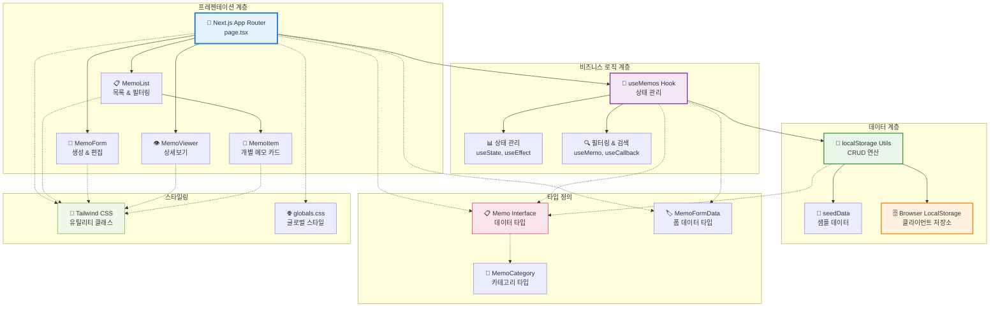

# 메모 앱 시스템 아키텍처

## 개요

Next.js 기반의 메모 애플리케이션으로, LocalStorage를 사용한 클라이언트 사이드 데이터 저장과 React 컴포넌트 기반 아키텍처를 가지고 있습니다.

## 시스템 아키텍처 다이어그램

## 구성 요소 설명

### 프레젠테이션 계층
- **page.tsx**: 메인 애플리케이션 컴포넌트, 전체 상태 관리와 모달 제어
- **MemoList**: 메모 목록 표시, 검색 및 카테고리 필터링 UI
- **MemoForm**: 메모 생성/편집을 위한 모달 폼
- **MemoViewer**: 메모 상세보기 모달
- **MemoItem**: 개별 메모 카드 컴포넌트

### 비즈니스 로직 계층
- **useMemos Hook**: 메모 관련 모든 비즈니스 로직을 캡슐화
- **상태 관리**: React Hooks를 활용한 클라이언트 상태 관리
- **필터링 & 검색**: 실시간 검색 및 카테고리 필터링 로직

### 데이터 계층
- **localStorage Utils**: LocalStorage와의 CRUD 연산을 담당하는 유틸리티
- **seedData**: 앱 첫 실행 시 샘플 데이터 생성
- **Browser LocalStorage**: 브라우저의 로컬 저장소

### 타입 정의
- **Memo Interface**: 메모 데이터 구조 정의
- **MemoFormData**: 폼 입력 데이터 타입
- **MemoCategory**: 메모 카테고리 타입 정의

### 스타일링
- **Tailwind CSS**: 유틸리티 퍼스트 CSS 프레임워크
- **globals.css**: 전역 스타일 정의

## 데이터 플로우

1. **사용자 상호작용** → page.tsx에서 이벤트 처리
2. **상태 업데이트** → useMemos Hook을 통한 상태 관리
3. **데이터 영속화** → localStorage Utils를 통한 로컬 저장
4. **UI 업데이트** → React 상태 변경으로 인한 리렌더링

## 주요 특징

- **클라이언트 사이드 렌더링**: Next.js App Router 기반
- **로컬 데이터 저장**: LocalStorage 활용으로 오프라인 지원
- **컴포넌트 기반 아키텍처**: 재사용 가능한 모듈화된 구조
- **타입 안전성**: TypeScript를 활용한 타입 정의
- **반응형 디자인**: Tailwind CSS를 활용한 모던 UI

## 확장 가능성

현재 아키텍처는 다음과 같은 확장이 가능합니다:
- **백엔드 연동**: localStorage → 서버 API로 전환
- **실시간 동기화**: WebSocket 또는 Server-Sent Events 추가
- **사용자 인증**: 인증 시스템 통합
- **데이터베이스 연동**: Supabase, Firebase 등 외부 데이터베이스 연결